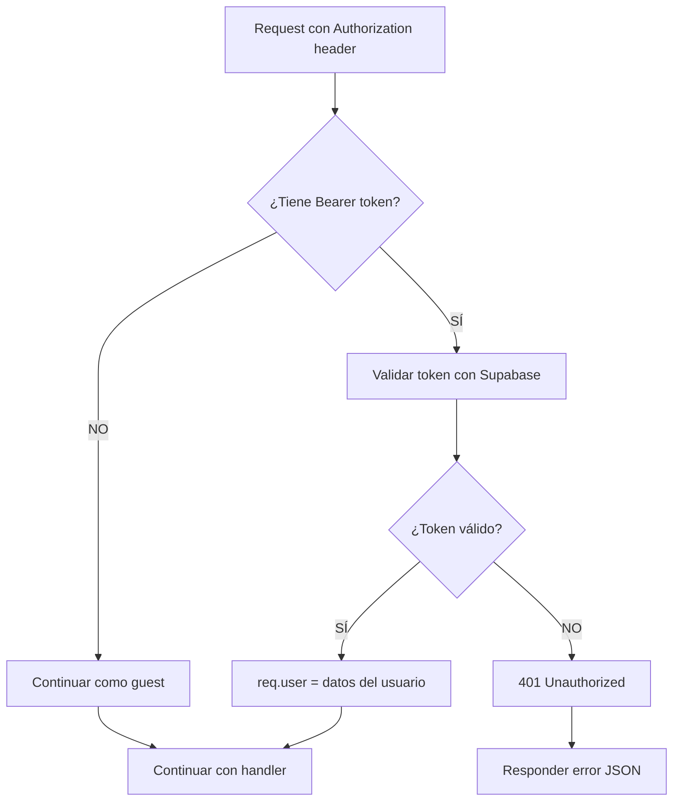

# Sistema de Autenticación JWT con Supabase

## Objetivo

Validar tokens de Supabase de forma segura sin romper el chat cuando falla la autenticación.

## Estrategia

- **Auth opcional**: Si no hay token → continúa como guest
- **Validación robusta**: Errores de auth → 401 (NO 500)
- **Sin bloqueos**: Chat funciona con o sin autenticación

---

## Middleware Implementado

### `optionalAuth`
**Ubicación**: `src/middleware/auth.ts`

**Comportamiento**:
- ✅ Si hay token válido → `req.user` con datos del usuario
- ✅ Si NO hay token → continúa sin `req.user` (modo guest)
- ❌ Si hay token inválido → 401 Unauthorized

**Uso**:
```typescript
import { optionalAuth, getUserId } from '../middleware/auth';

router.post('/chat', optionalAuth, async (req, res) => {
  const userId = getUserId(req); // Prioridad: req.user.id > body.userId
  // ...
});
```

### `requireAuth`
**Ubicación**: `src/middleware/auth.ts`

**Comportamiento**:
- ✅ Si hay token válido → `req.user` con datos del usuario
- ❌ Si NO hay token → 401 Unauthorized
- ❌ Si hay token inválido → 401 Unauthorized

**Uso**:
```typescript
import { requireAuth } from '../middleware/auth';

router.post('/admin/delete', requireAuth, async (req, res) => {
  // Solo usuarios autenticados pueden ejecutar esto
  const userId = req.user.id; // Garantizado que existe
  // ...
});
```

---

## Helper: `getUserId(req)`

Obtiene el ID del usuario con prioridad:
1. `req.user.id` (si está autenticado)
2. `req.body.userId` (del body)
3. `req.body.user_id` (del body, snake_case)
4. `undefined` (si no hay ninguno)

---

## Endpoints con Auth

### `/api/ai/chat` → `optionalAuth`
- Soporta usuarios autenticados Y guest
- Si viene token JWT: valida y usa `req.user.id`
- Si NO viene token: usa `userId` del body

### `/api/files/ingest` → `optionalAuth`
- Ingesta de documentos con auth opcional
- Usuario autenticado: archivos asociados a su UUID
- Guest: archivos con `user_id` del body (o null)

### `/api/files/list` → `optionalAuth`
- Lista archivos del workspace/user
- Usuario autenticado: filtra por su UUID
- Guest: filtra por `user_id` del query

### `/api/files/stats` → `optionalAuth`
- Estadísticas de conocimiento ingerido
- Misma lógica que `/list`

---

## Flujo de Validación



---

## Try/Catch Robusto

**ANTES (problema)**:
```typescript
// Si Supabase truena → 500 Internal Server Error
const { data } = await supabase.auth.getUser(token);
```

**DESPUÉS (solución)**:
```typescript
try {
  const { data, error } = await supabase.auth.getUser(token);
  if (error || !data.user) {
    return res.status(401).json({ error: 'UNAUTHORIZED' });
  }
  req.user = data.user;
  next();
} catch (err) {
  // Captura CUALQUIER error inesperado
  return res.status(401).json({ error: 'AUTH_ERROR' });
}
```

---

## Testing

### 1. Sin token (guest mode)
```bash
curl -X POST https://api.al-eon.com/api/ai/chat \
  -H "Content-Type: application/json" \
  -d '{
    "userId": "test-guest",
    "mode": "universal",
    "messages": [{"role": "user", "content": "Hola"}]
  }'
```

**Esperado**: 200 OK, respuesta de AL-E

### 2. Con token válido
```bash
curl -X POST https://api.al-eon.com/api/ai/chat \
  -H "Content-Type: application/json" \
  -H "Authorization: Bearer <supabase_access_token>" \
  -d '{
    "mode": "universal",
    "messages": [{"role": "user", "content": "Hola"}]
  }'
```

**Esperado**: 200 OK, usa `req.user.id` automáticamente

### 3. Con token inválido
```bash
curl -X POST https://api.al-eon.com/api/ai/chat \
  -H "Content-Type: application/json" \
  -H "Authorization: Bearer token_invalido_123" \
  -d '{
    "mode": "universal",
    "messages": [{"role": "user", "content": "Hola"}]
  }'
```

**Esperado**: 401 Unauthorized
```json
{
  "error": "UNAUTHORIZED",
  "message": "Token inválido o expirado"
}
```

---

## Variables de Entorno Requeridas

**En `.env` o EC2**:
```bash
SUPABASE_URL=https://gptwzuqmuvzttajgjrry.supabase.co
SUPABASE_SERVICE_ROLE_KEY=<tu_service_role_key>
```

⚠️ **Importante**: Usa `SUPABASE_SERVICE_ROLE_KEY` (no anon key) para validar tokens en backend.

---

## Logs de Debug

Con el middleware activado, verás logs como:

```
[AUTH] No token provided - continuing as guest
```

```
[AUTH] Validating token...
[AUTH] ✓ User authenticated: a1b2c3d4-uuid email@example.com
```

```
[AUTH] Invalid token: JWT expired
```

---

## Ventajas

✅ **No rompe el chat**: Guest mode funciona sin token  
✅ **Seguro**: Validación con Supabase auth  
✅ **Predecible**: Siempre 401 (nunca 500) si falla auth  
✅ **Try/catch completo**: Captura errores inesperados  
✅ **Extensible**: Fácil agregar `requireAuth` a nuevos endpoints  

---

## Próximos Pasos

1. **Deploy a EC2** con las variables correctas
2. **Probar desde frontend** con `session.access_token`
3. **Monitorear logs** de auth en PM2
4. Si necesitas endpoints protegidos: usar `requireAuth`
